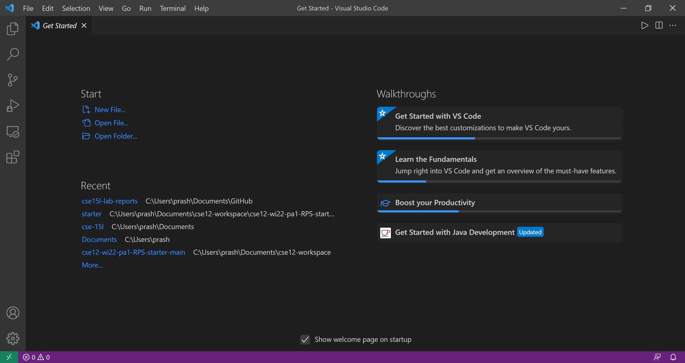
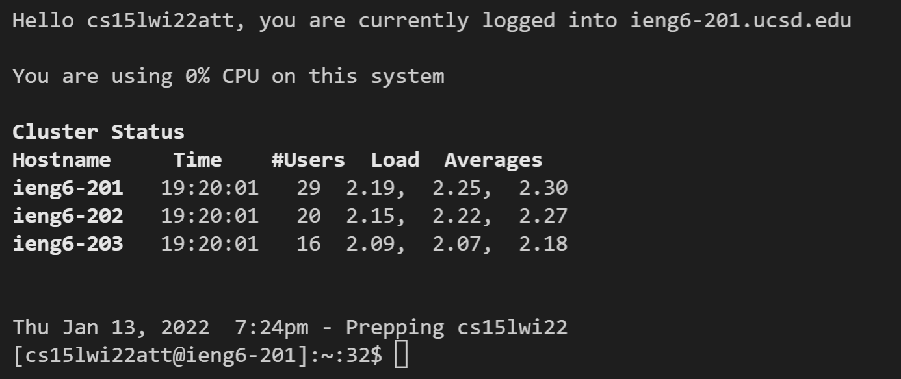
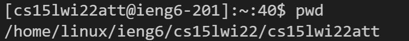
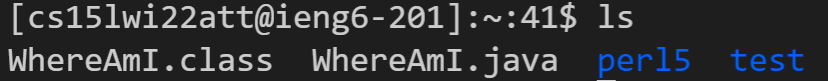
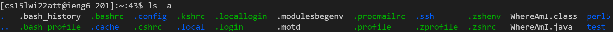
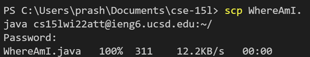
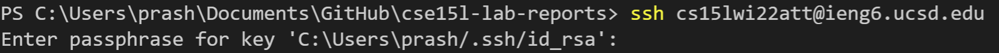
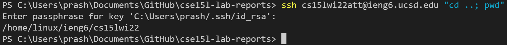

&nbsp;  


<p style="font-size:21px" align="center"> Remote Access Tutorial </p>

<p align="center">This tutorial will help you learn all of the basics of remote access!</p>

&nbsp;  

## 1. Installing Visual Studio Code
Make sure to install Visual Studio Code ([https://code.visualstudio.com/](https://code.visualstudio.com/)) and follow the installation steps. Once you open Visual Studio Code, it should look something like this: 


&nbsp;  

## 2. Remotely Connecting 
Open a terminal on VS Code by clicking on **Terminal** at the top menu bar and then clicking **New Terminal**. To request access to one of the remote servers at UCSD type this in the terminal:
```
ssh cse15lwi22att@ieng6.ucsd.edu
```
Enter the password you have for this account. Note that you will not be able to see any indication of the password you have typed out, but rest assured, your key strokes are going through. If it is successful, you will see an output similar to this:



&nbsp;  

## 3. Trying Some Commands
Here are some commands you should be familiar with:
* `cd ~` -- changes directory to home directory   
* `pwd` -- prints working (current) 
directory


* `ls` -- prints contents of current directory 


* `ls -a` -- prints all contents of current directory including hidden files


* `cp sourcefile... targetdirectory` -- copies source file from a directory to target directory

&nbsp;  

## 4. Moving Files with `scp`
To copy a file from your current directory on the client (your computer) to the home directory of your server, follow this command:    
`scp fileName cs15lwi22att@ieng6.ucsd.edu:~/`

Enter your password. This is what your terminal should like:


&nbsp;  

## 5. Setting an SSH Key
To create a SSH key for easier access to the remote server (without having to type in your password every time), type
`ssh-keygen` on the client side. Save the key in the location given and create a passphrase to use instead of your password when logging in. This will create an SSH key and when you `ssh` from now on, the terminal should look like this:



Enter your passphrase to log into the server.

&nbsp;  

## 6. Optimizing Remote Running
Luckily, we can make running commands remotely more convenient. Let's say we want to run multiple commands on the same line. We can insert semicolons between commands on the same line.
For example, `ssh cs15wi22att@ieng6.ucsd.edu ls; javac Hello.java` will ssh into the server, list contents of the current directory, exit the server, and then compile Hello.java on the client side. Note that if we want to run both commands on the server, we can use put all the commands we want to run in quotes, separated by semicolons. For example, with the command `ssh cs15wi22att@ieng6.ucsd.edu "ls; javac Hello.java"` the server will be exited only after the closing double quotes.


