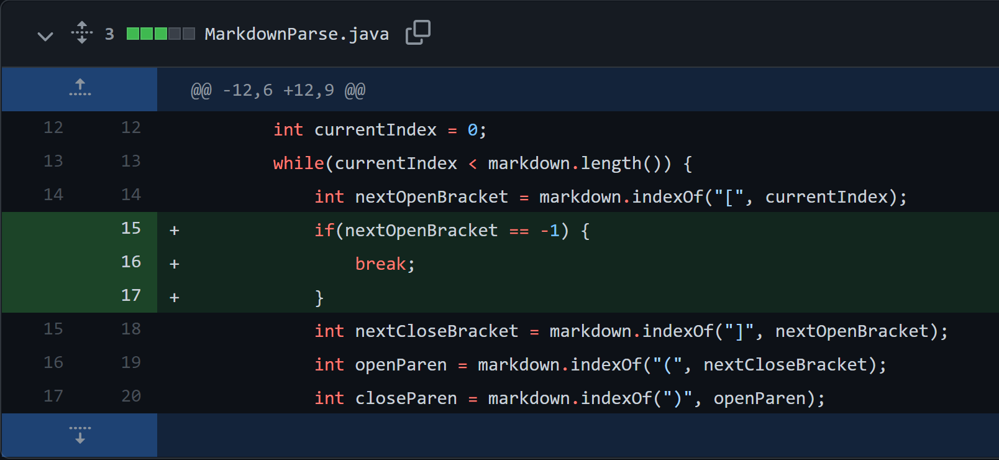
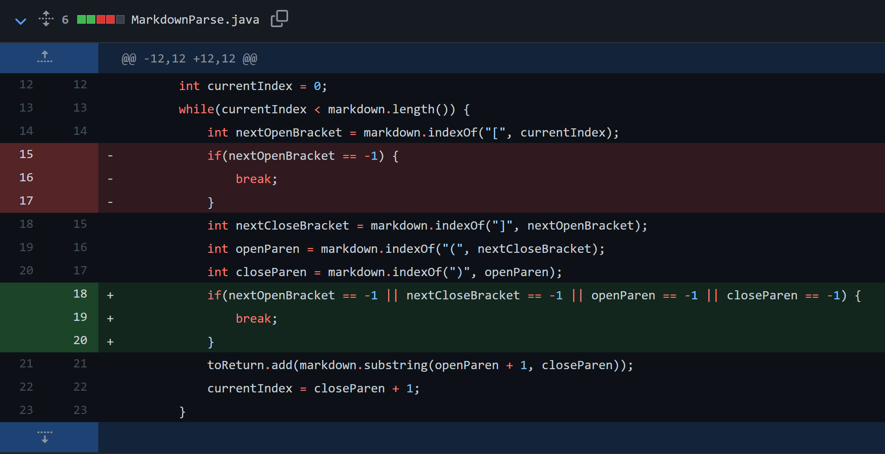
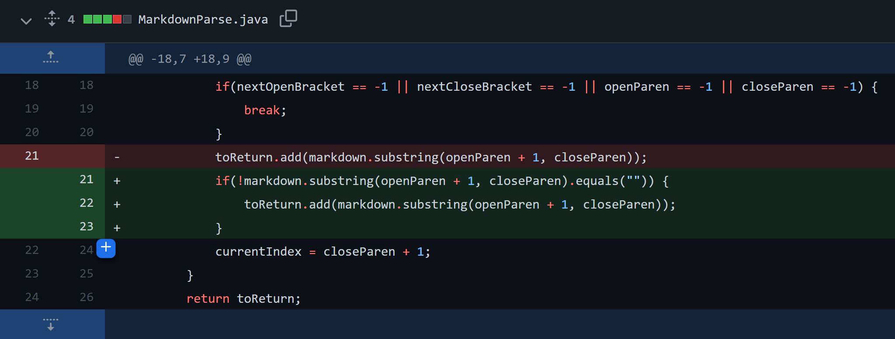

## Bug Fix #1 


Failure-inducing input: [Click to view Test File #1](test-file.md)

Symptom:  
```
Exception in thread "main" java.lang.OutOfMemoryError: Java heap space
```

This bug occurs because `nextOpenBracket` is set to -1 because `indexOf` can not find an open bracket after the closing parentheses in the failure-inducing input: `[a link!](http)s://something.com)`. Because it is searching from index -1, the program will find the first closing bracket and will parse through the same link infinitely, never breaking out of the while loop. This is why we see the out of memory error returned (shown above) as the symptom.

&nbsp;
## Bug Fix #2 


Failure-inducing input: [Test File #2](test-file2.md)

Symptom:
```
Exception in thread "main" java.lang.StringIndexOutOfBoundsException: begin 21, end -1, length 42
```
The bug occurs when the program can not find `closingParen` in the failure-inducing input: `[a link!](https://something.com`  Therefore, its value will be set to -1 and the substring that the program tries to grab is between index 22 and -1. Therefore, this will throw an `StringIndexOutOfBoundsException` error in the terminal (shown above) as the symptom.

&nbsp;

## Bug Fix #3


Failure-inducing input: [Test File #3](test-file3.md)

Symptom (output):
```
[, https://www.google.com/]
```

This bug occurs when there is an empty link that the program parses through, in which an empty string is read and inserted into the list of links. This failure-inducing input does not cause an runtime error but causes the symptom shown above. In reality, there is no link to be returned to the user, so it should be ignored and the correct output should just include the last link: `[https://www.google.com/]`