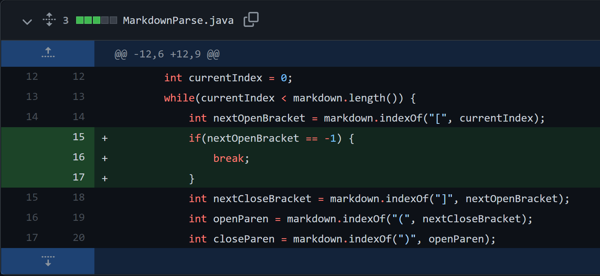
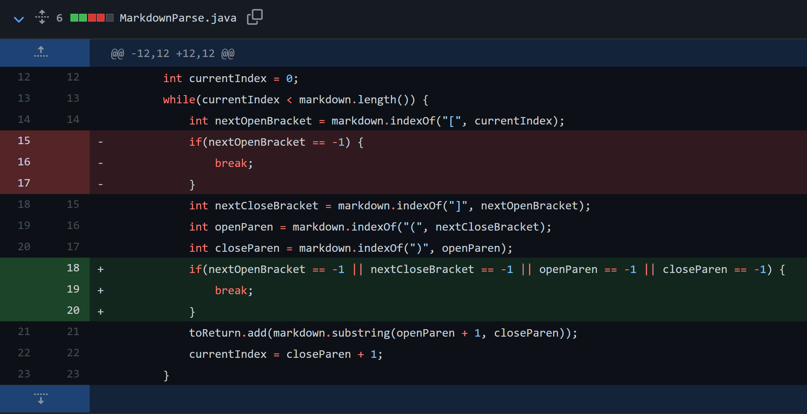
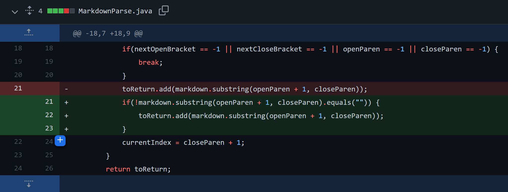

## Bug Fix #1 


Failure-inducing input: [Click to view Test File #1](report_2_files/test-file.md)

Symptom:  
```
> java MarkdownParse test-file.md 

Output: Exception in thread "main" java.lang.OutOfMemoryError: Java heap space
```

This bug occurs because `nextOpenBracket` is set to -1 because `indexOf` can not find an open bracket after the closing parentheses in the failure-inducing string input from test-file.md. Because it is searching from index -1, the program will find the first closing bracket and will parse through the same link infinitely, never breaking out of the while loop. This is why we eventually see the out of memory error returned (shown above) as the symptom.

&nbsp;
## Bug Fix #2 


Failure-inducing input: [Test File #2](test-file2.md)

Symptom:
```
> java MarkdownParse test-file2.md

Output: Exception in thread "main" java.lang.StringIndexOutOfBoundsException: begin 21, end -1, length 42
```
The bug occurs because `closingParen` is -1 since `indexOf` was not able to find closing parentheses in the failure-inducing string input from test-file2.md. Therefore, the substring that the program tries to grab at the end of the `getLinks` method is between index 21 and -1. Since the end index is less than beginning index, it will throw an `StringIndexOutOfBoundsException` error in the terminal (shown above) as the symptom.

&nbsp;

## Bug Fix #3


Failure-inducing input: [Test File #3](test-file3.md)

Symptom:
```
> java MarkdownParse test-file3.md

Output: [, https://www.google.com/]
```

This bug occurs because the program reads and inserts an empty string into the list of links when parsing through an empty link. This failure-inducing input from test-file3.md does not cause an runtime error but causes the symptom shown above, where there are two elements in the list (an empty string and the nonempty string). In reality, the first string is not a link, so empty strings should be ignored and the correct output should just include the last link: `[https://www.google.com/]`