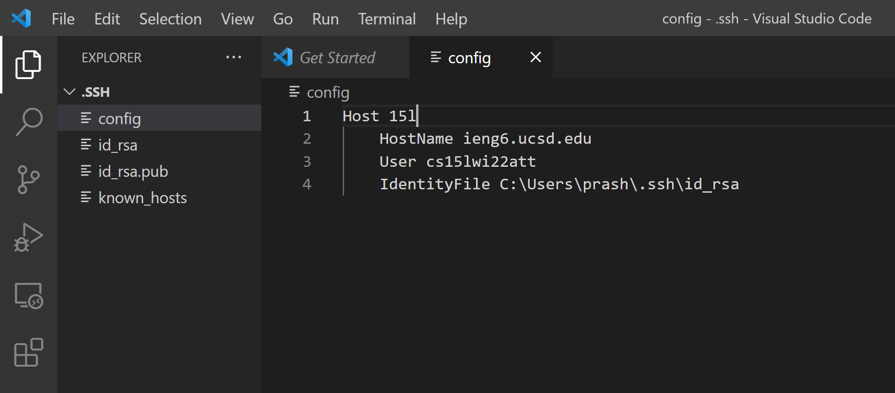

# Streamlining SSH Configuration

## Config File

I created and edited my `.ssh/config` file with VS Code by opening the directory on the program. The directory was `C:\Users\[username]\.ssh`. Then I clicked on "New File" next to the ".SSH" dropdown on the left and named the file `config` with specified no extension. Shown above is the contents of my config file that uses an alias to streamline the `ssh`  process into my remote server.

&nbsp;

## SSH Command

I choose the alias "15l" (seen in the config file) to quickly `ssh` into my remote server. It is much quicker than typing the full address of the server `cs15lwi22zzz@ieng6.ucsd.edu`. This command only requires 8 keystokes to log into the server, excluding the keystrokes for the passphrase. This is compared to 32 keystrokes (once again excluding passphrase) if you used the full address, which is 4 times more than using the alias. 

&nbsp;

## `scp` Command

The `scp` command, the command to copy files, also becomes a lot quicker with an alias. On the client side, I was able to copy `HelloWorld.txt` to the home directory of my remote server simply by `scp HelloWorld.txt 15l:~/`. This only required 26 keystrokes, excluding the passphrase, while doing `scp` with the full address requires 50 keystrokes to copy over a file. As shown above, when we log into the remote server, `HelloWorld.txt` has successfully been copied to the home directory of the server. 

