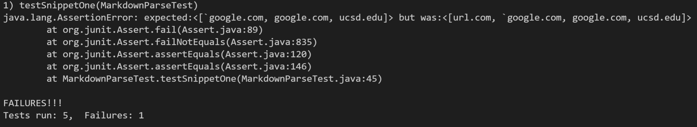

## Snippet 1

The test should produce the output ``[`google.com, google.com, ucsd.edu]``.
### JUnit Test

### Running the Test on my MarkdownParse

### Running the Test on other's MarkdownParse

I could create a small code change that would specifically address the snippet one test case, but in order to account for all related cases, it would require more than 10 lines. That is because I would have to check for one backquote ` then check if there is an opening or closing bracket/parenthesis after the backquote and then check if there is a closing backquote afterward. That is because if a bracket or parentheses is in between the backquotes, it is not a valid link. 

&nbsp;

## Snippet 2
The test should produce the output `[a.com, a.com(()), example.com]`.
### JUnit Test

### Running the Test on my MarkdownParse

### Running the Test on other's MarkdownParse

I would have to create separate logic that checks for nested parentheses. First I would have to check for multiple pairs of opening and closing parenthesis and then keep track of which closing parenthesis pairs with which opening parenthesis, so that I can find between which parenthesis the link exactly lies. Therefore, this would not be a small code change because it requires complicated logic. 

&nbsp;

## Snippet 3
The test should produce the output `[https://www.twitter.com, https://ucsd-cse15l-w22.github.io/, https://cse.ucsd.edu/]`.

### JUnit Test

### Running the Test on my MarkdownParse

### Running the Test on other's MarkdownParse

I think there is a small code change for test cases with newlines in brackets and parenthesis. For example, after the first opening bracket and before the closing parenthesis, I could trim all the newlines in the link by using the String `replaceAll` method. The method would be configured to replace all newlines with an empty string so that there aren't unnecessary spaces in brackets and parentheses. Once the links are formatted properly, the rest of the code will work properly to get the links.

