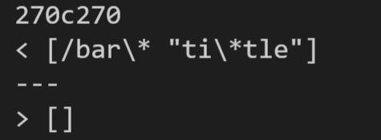
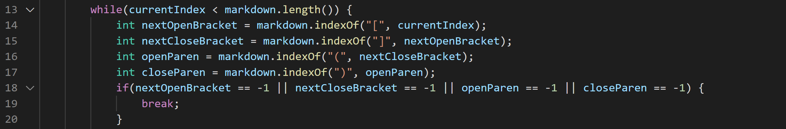
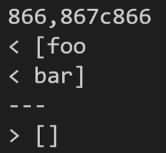
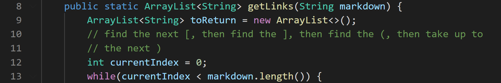

## Finding the Tests

I found the tests with different results by first printing the results of my implementation of markdown-parse and the cse15l implementation to text files using `bash script.sh > results.txt`. Then, I used the `diff` command to compare the text files and picked two cases where there were differences between the files. I went back to both of the text files, ran `vim`, and navigated to the lines where there were reported differences. Since I printed the file name for each test in the bash script, I was able to find that there were different results in `22.md` and `489.md`. 

&nbsp;

## 22.md
Difference:



The cse15l implementation is correct because the input for this test `[foo](/bar\* "ti\*tle")` is not a valid link, so it is appropriate that empty list of links is returned from this test (like the cse15l implementation does). My implementation is not correct because it recognizes it as a link and returns `[/bar\* "ti\*tle"]`. The problem in my code is that it does not check if the text within the parentheses is actually a link, so I need to add code in my getLinks method, between lines 16 and 17 in the image below, to recognize the extension and the different components of a valid link. 

 

&nbsp;

## 489.md
Difference:



The cse15l implementation is correct here again because the input for this test 
```
[link](foo
bar)
```
does not contain a single valid link, so it is appropriate that the cse15l implementation returned an empty list of links. On the other hand, not only did my implementation recognize it as a link (the first bug), it also considers the newline as part of the link so it keeps it in the output (the second bug). That is why my implementation returns: 
```
[foo
bar] 
```
for this test. The first bug can be addressed by the fix mentioned in the previous test, but in order to fix the second bug, I need to remove any newlines or empty lines at the beginning of the parse in the getLinks method, even before I check there is a valid link. 



